# Custom Compressed Trie

An implementation of a compressed Prefix-Trie.

*For the standard, non-compressed implementation, see [Custom Trie](https://github.com/bk10aao/CustomTrie).*

# Build and Test

To build and test the project run command `./gradlew clean build`

# Time Complexity

| Method                      | V1                                              | V2 (Compressed)                                 |
|:----------------------------|:------------------------------------------------|:------------------------------------------------|
| `Constructor()`             | $O(1)$                                          | $O(1)$                                          |
| `Constructor(List<String>)` | $O(W \log \Sigma)$                              | $O(W \log \Sigma)$                              |
| `Constructor(String[])`     | $O(W \log \Sigma)$                              | $O(W \log \Sigma)$                              |
| `Constructor(Trie)`         | $O(S \log \Sigma)$                              | $O(S \log \Sigma)$                              |
| `clear()`                   | $O(1)$                                          | $O(1)$                                          |
| `delete(String)`            | $O(L \log \Sigma)$                              | $O(L \log \Sigma)$                              |
| `equals(Object)`            | $O(S \log \Sigma)$                              | $O(S \log \Sigma)$                              |
| `hashCode()`                | $O(S \log \Sigma)$                              | $O(S \log \Sigma)$                              |
| `insert(String)`            | $O(L \log \Sigma)$                              | $O(L \log \Sigma)$                              |
| `isEmpty()`                 | $O(1)$                                          | $O(1)$                                          |
| `search(String)`            | $O(L \log \Sigma)$                              | $O(L \log \Sigma)$                              |
| `size()`                    | $O(1)$                                          | $O(1)$                                          |
| `startsWith(String)`        | $O(P \log \Sigma + L_{\text{out}} \log \Sigma)$ | $O(P \log \Sigma + L_{\text{out}} \log \Sigma)$ |
| `toString()`                | $O(S \log \Sigma)$                              | $O(S \log \Sigma)$                              |

# Space Complexity

| Method                               | V1                             | V2 (Compressed)                |
|:-------------------------------------|:-------------------------------|:-------------------------------|
| **Overall Structure Storage (Heap)** | $O(S)$                         | $O(N + S)$                     |
| `Constructor()`                      | $O(1)$                         | $O(1)$                         |
| `Constructor(List<String>)`          | $O(1)$                         | $O(L_{\max})$                  |
| `Constructor(String[])`              | $O(1)$                         | $O(L_{\max})$                  |
| `Constructor(Trie)`                  | $O(S)$                         | $O(S)$                         |
| `clear()`                            | $O(1)$                         | $O(1)$                         |
| `delete(String)`                     | $O(L)$                         | $O(L)$                         |
| `equals(Object)`                     | $O(S)$                         | $O(S)$                         |
| `hashCode()`                         | $O(S)$                         | $O(S)$                         |
| `insert(String)`                     | $O(1)$                         | $O(L)$                         |
| `isEmpty()`                          | $O(1)$                         | $O(1)$                         |
| `search(String)`                     | $O(1)$                         | $O(L)$                         |
| `size()`                             | $O(1)$                         | $O(1)$                         |
| `startsWith(String)`                 | $O(L_{\text{out}} + L_{\max})$ | $O(L_{\text{out}} + L_{\max})$ |
| `toString()`                         | $O(S)$                         | $O(S)$                         |

### Notes & Variable Definitions
- **$L$**: Length of the target word / input string parameter.
- **$P$**: Length of the search prefix.
- **$\Sigma$**: Alphabet size / maximum branching factor.
- **$W$**: Total character count across an input list or array ($\sum L_i$).
- **$S$**: Total character count across all words stored in the trie ($\sum L_i$).
- **$N$**: Total number of distinct words stored in the trie.
- **$L_{\text{out}}$**: Total character count of all matching words returned by prefix matching.
- **$L_{\max}$**: Maximum word length in the collection.

# Performance

Below performance is a comparison made at 100,000 operations per method.

Note: all data is evaluated at 100,000 operations scale.

| Method                  | Non-compressed Trie (ns) | Compressed Trie (ns) |            Winner            | Margin |
|:------------------------|:-------------------------|:---------------------|:----------------------------:|:------:|
| `Constructor()`         | 4                        | 5                    | **Statistically Equivalent** | 1.25x  |
| `Constructor(Trie)`     | 37,037,991               | 14,252,349           |      **CompressedTrie**      | 2.60x  |
| `Constructor(List)`     | 31,221,635               | 25,719,680           |      **CompressedTrie**      | 1.21x  |
| `Constructor(String[])` | 32,054,071               | 27,426,442           |      **CompressedTrie**      | 1.17x  |
| `clear()`               | 6,487                    | 886                  |      **CompressedTrie**      | 7.32x  |
| `delete(String)`        | 4,050                    | 8,564                |        **CustomTrie**        | 2.11x  |
| `equals(Object)`        | 50,091,344               | 10,526,838           |      **CompressedTrie**      | 4.76x  |
| `hashCode()`            | 26,603,385               | 6,195,431            |      **CompressedTrie**      | 4.29x  |
| `insert(String)`        | 35,099,565               | 28,190,140           |      **CompressedTrie**      | 1.25x  |
| `isEmpty()`             | 1                        | 1                    | **Statistically Equivalent** | 1.00x  |
| `search(Key Found)`     | 85                       | 49                   |      **CompressedTrie**      | 1.73x  |
| `search(Key Not Found)` | 6                        | 6                    | **Statistically Equivalent** | 1.00x  |
| `size()`                | 1                        | 1                    | **Statistically Equivalent** | 1.00x  |
| `startsWith(String)`    | 246                      | 122                  |      **CompressedTrie**      | 2.02x  |
| `toString()`            | 26,229,529               | 5,749,411            |      **CompressedTrie**      | 4.56x  |

# Performance Charts

#### Note: The following performance charts are designed to be viewed in dark mode.
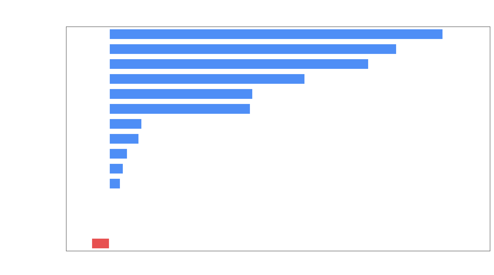
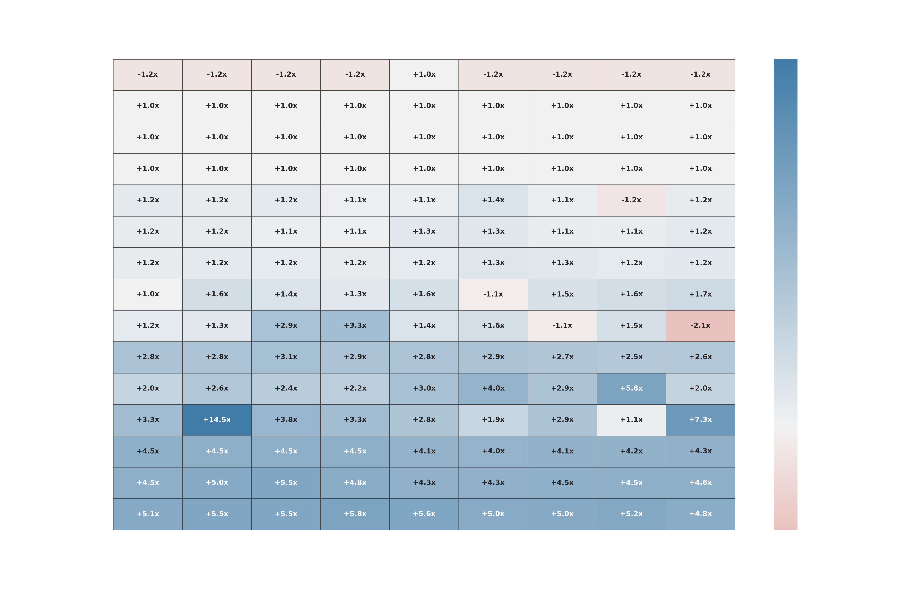
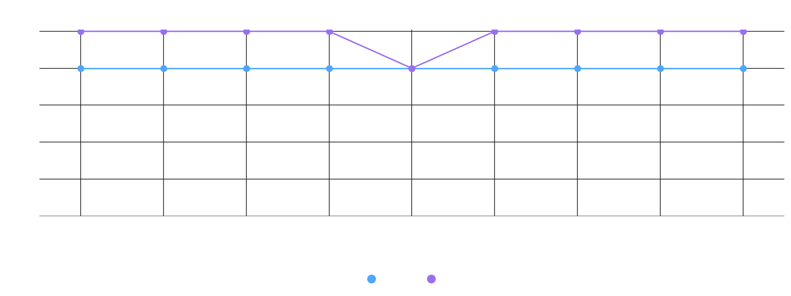
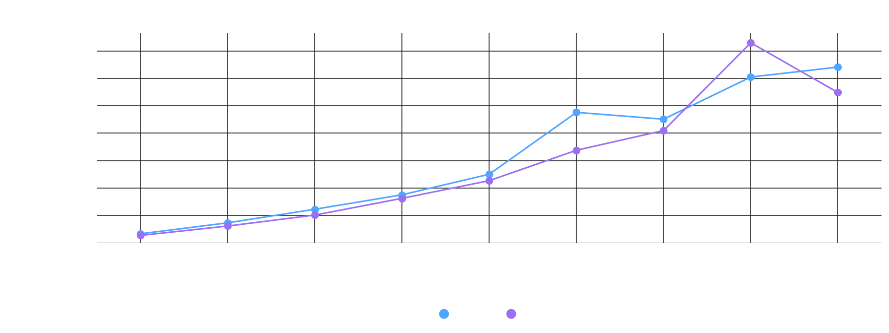
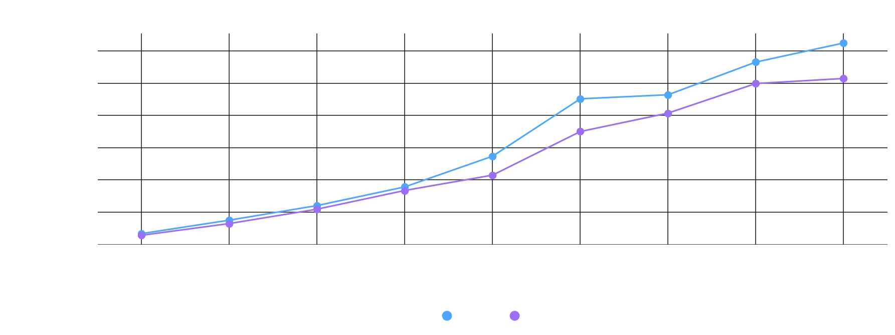
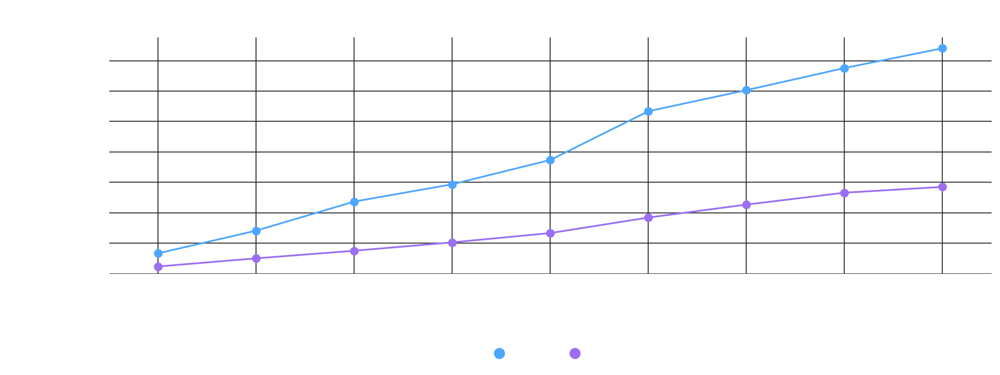
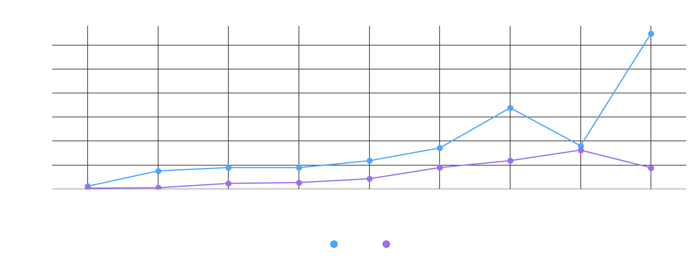
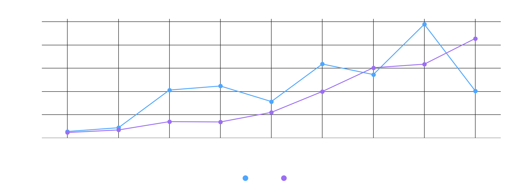
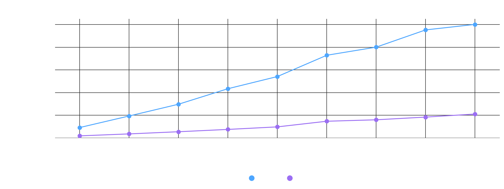
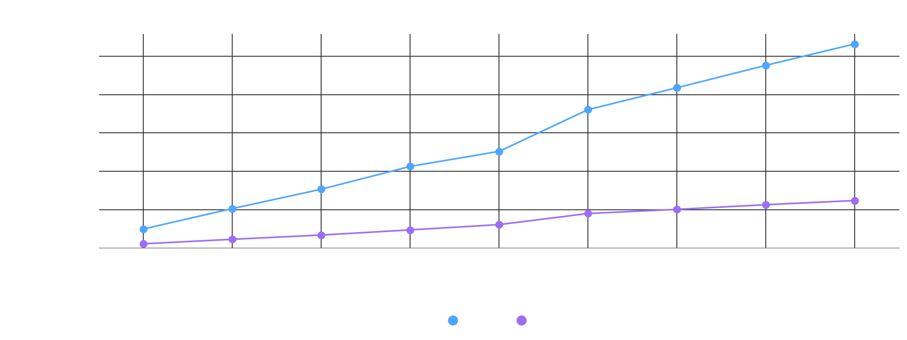
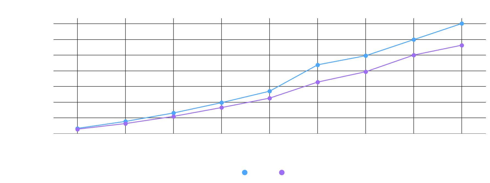
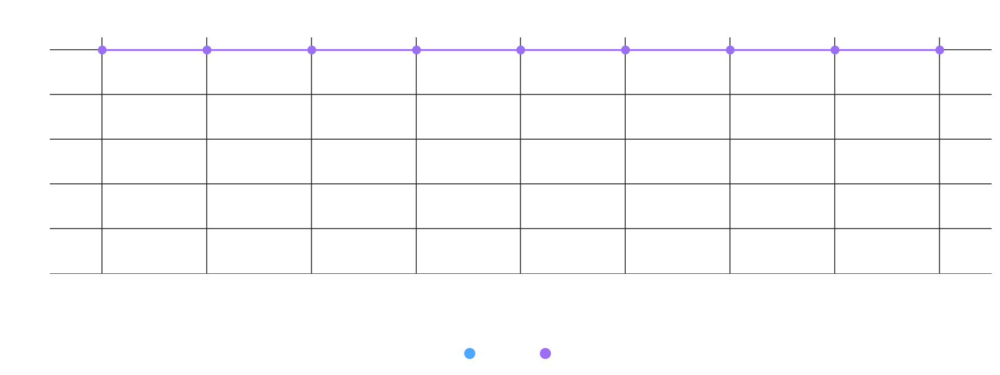
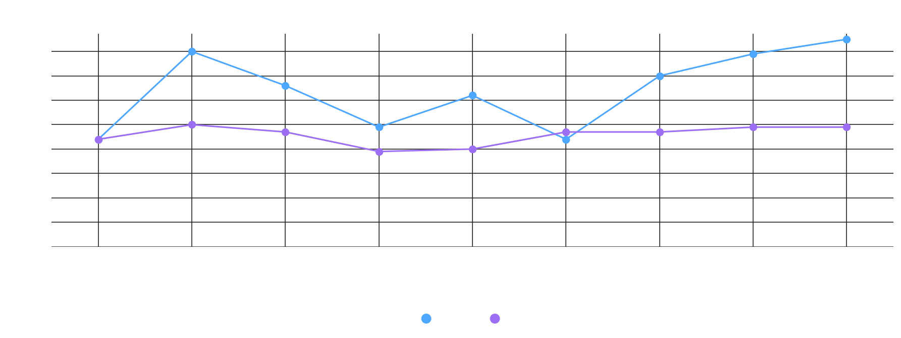
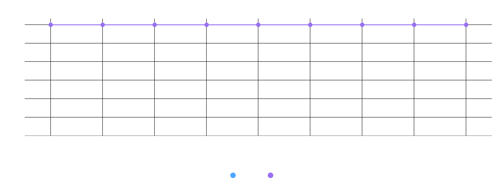
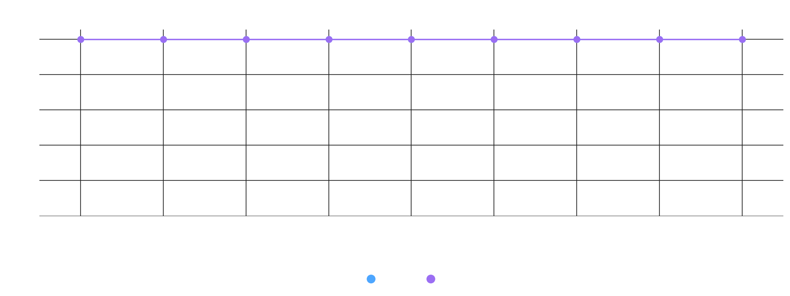
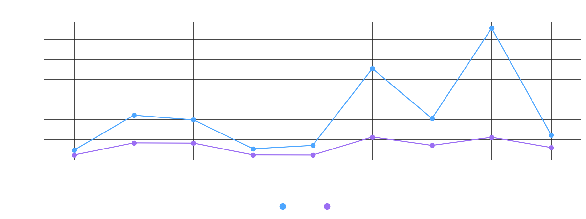
